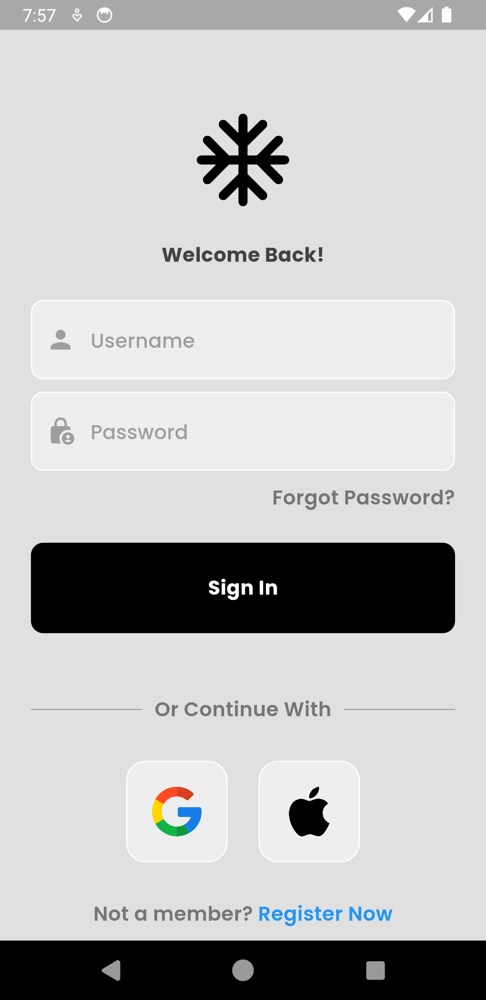

```markdown
# Auth App



This Flutter app provides a user interface for authentication using Firebase Authentication.
The backend and Firebase integration are currently under development.

## Features

- User Sign Up
- User Sign In
- Forgot Password
- UI Components (TextField, Button)

## Getting Started

To get started with this project, follow these steps:

### Prerequisites

- Make sure you have [Flutter](https://flutter.dev/docs/get-started/install) installed on your machine.
- Clone this repository:

  ```bash
  https://github.com/saim-x/FlutterAuthApp.git
  ```

### Installation

1. Navigate to the project directory:

   ```bash
   cd auth_app
   ```

2. Install dependencies:

   ```bash
   flutter pub get
   ```

### Usage

Run the app on an emulator or connected device:

```bash
flutter run
```

### Firebase Integration (Under Development)

The Firebase and backend integration for this project is currently under development. Follow the steps below to integrate Firebase Authentication:

1. [Create a Firebase Project](https://console.firebase.google.com/).
2. Add your Android/iOS app to the Firebase project.
3. Download and add the `google-services.json` (Android) or `GoogleService-Info.plist` (iOS) file to the respective app folders.
4. Enable Firebase Authentication in the Firebase console.

### Contributing

Contributions are welcome! If you have suggestions, bug reports, or feature requests, please open an issue.

